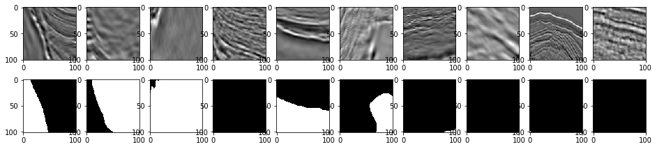
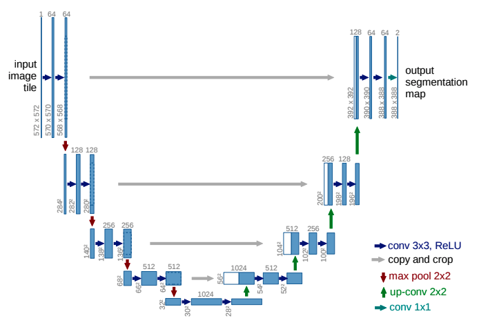

# U-Nets with transfer learning

Tensorflow + Keras implementation of a 1) depth-configurable [U-Net](https://arxiv.org/abs/1505.04597), 2) transfer-learning based U-Net using a pre-trained VGG-16 network that can be imported and used in your personal projects. Additionally, my solution to the Kaggle TGS Salt Identification Challenge from 2018 where I developed these U-Nets is contained in this repository.

### Contents

**The U-Net package:**

[Installation](#installation)

[Core Functions](#core-functions)

**Kaggle competition solution:**

[Competition Overview](#overview)

[Scoring](#scoring)

[My solution](#my-solution)

### Installation

To install all packages required to run the analysis in the associated Jupyter notebooks, you can install the correct packages/versions with the `environment.yml` file:

```bash
conda env create -f environment.yml
```

which will install a new `conda` environment called `unet_salt` that has all the required packages. You may need to modify the `environment.yml` file so that the `cudatoolkit` version matches your specific CUDA version.

To install only the important neural network related functions for Tensorflow / Keras directly to your existing environment, from the main `kaggle_salt` project directory run:

```bash
conda activate <your environment here>
pip install .
```

### Core functions:

These functions can be found within the `unet` folder, or will be available to you if you install the package to your Python environment.
#### `unet.unet_model` 
Function to produce untrained U-Net models mostly following the original U-net paper.
It is designed so that the U-Net can be scaled automatically to be deeper/shallower during
model initialization. Additionally, the number of convolutional filters in each layer
can be adjusted during initialization.

**Parameters:**
- `filter_scaling`: Different layers of the U-Net will have multiples of the previous layer
in terms of the number of convoluational filters. This allows for the base rate of filters
in the initial layer, from which all others are derived, to be increased/decreased.

- `depth`: The number of times the ladder repeats during its descent before repeating back up.

- `batch_norm_momentum`: The normal momentum hyperparameter for all the BatchNorm layers in the U-Net

- `optimizer`: Optimizer used to make the actual model weight/bias updates based on the gradients.

#### `unet.transfer_unet_model`
U-Net model that uses a pre-trained VGG-16 as the encoder side of the ladder. The decoder
part of the ladder that produces the final mask is initialized with the He normal initialization
with the matching VGG16 geometry. Using the pre-trained model allows us to get the benefit of
transfer learning of the features that VGG-16 learned during its original ImageNet training.

**Parameters**
- `freeze_layer`: We freeze some of the lower level (closer to the input image) features in 
the pre-trained VGG-16 model, as is typical during transfer learning. This parameter allows
us to select where we want this freeze to begin.

- `batch_norm_momentum`: The normal momentum hyperparameter for all the BatchNorm layers in the U-Net

#### `metrics.IoU`
Function to quickly calculate the Intersection over Union (Jaccard) metric for two masks.
    
x and y are both numpy N x M masks

x = proposed mask

y = ground truth mask

0 for a pixel indicates the mask is blocked, 1 indicates the mask is not blocked.
In plain English, everywhere that is 1 we can see the cell, everywhere that is 0 we cannot.

We want to calculate the IoU statistic, which is intersection(x,y)/union(x,y) at values where x or y is 1 

By subtracting the proposed mask from 2 x the ground truth mask (i.e. blocked is 0, not blocked is 2),
then adding 1, we get unique values for each type of overlap situation, plus all values are positive, which
is required to use np.bincount:

```
INDX  0  1  2  3  4  5  6  7  8  9 10 11

GT    0  0  0  2  2  2  2  2  0  0  0  0
MSK - 0  0  1  1  1  1  0  1  1  0  0  0  
      ----------------------------------
      0  0 -1  1  1  1  2  1 -1  0  0  0
    + 1  1  1  1  1  1  1  1  1  1  1  1
      ----------------------------------
      1  1  0  2  2  2  3  2  0  1  1  1
```

- 0: the proposed mask had a pixel, ground truth did not (include in union)   
- 1: neither mask had a pixel (don't include)
- 2: the proposed mask had a pixed, the ground truth had a pixel (include in intersection and union)
- 3: the proposed mask did not have a pixel, the ground truth did (include in union)

## TGS Salt Identification Challenge

### Overview

This repository contains my Tensorflow / Keras - based solution to the Kaggle TGS Salt Identification Challenge from fall of 2018. Additionally, the higher level functions I created to generate [U-Nets](https://arxiv.org/abs/1505.04597) of various sizes/configurations, process images, and perform evaluations are available for installation and use in your environment ([see below](#useful-functions)). I worked hard on this challenge and learned a great deal, and in the end I ended up with the following scores on the public/private leaderboards:

|                        | Public      | Private     |
| ---------------------- | :---------: | :---------: |
| **My best score**      | 0.78098     | 0.81249     |
| **Overall best score** | 0.88833     | 0.89646     |           

Private leaderboard
My score: 0.81249
Best score: 0.89646

The challenge centers around identifiying salt deposits in the earth's crust using siesmic imagery. [More info here](https://www.kaggle.com/c/tgs-salt-identification-challenge/overview) Experts have hand labeled a training set with masks to identify the location of these salt deposits. The challenge is an image segmentation task, where we must predict the masks that indicate locations of salt deposit for new images.

An example set of salt images and their associated masks I extracted during the data exploration phase:


If you wish to explore the data through my notebooks, it can be pulled through the Kaggle command line API:
```bash
kaggle competitions download -c tgs-salt-identification-challenge
```
For more information on using the API, see: [Official Kaggle API](https://github.com/Kaggle/kaggle-api)

### Scoring

This competition uses the Intersection over Union (IoU) score as the primary metric for evaluating each predicted image mask. If $A$ is the ground truth pixel mask, and $B$ is the model's mask prediction, the IoU score evaluates the degree of overlap of the two masks, relative to their total size, and is defined as:


which is also the Jaccard score for the two masks. These IoU's are in turn evaluated for different threshold values, and the resulting confusion matrix elements over the total set of images are averaged across the thresholds. [Further reading here](https://www.kaggle.com/c/tgs-salt-identification-challenge/overview/evaluation).

### My solution

My solution centered around using U-Nets to predict the salt masks. U-Nets were originally developed for biomedical image segmentation, but they quickly caught on for many different types of segmentation tasks, as they tended to often be faster and more accurate than existing solutions at the time. I initially tried using Mask-RCNN, but found these exact problems, and so switched to U-Net. 

U-Nets are essentially encoder-decoder style networks, except with skip connections from very early layers to much later layers. It's easier to think of the networks as a kind of ladder, where successive convolutional layers encode higher level features in the image, and the decoder is then used to convert these higher level features back to their low level pixel representation, but in mask form (i.e. pixels that indicate where an abstract object resides in the image). The diagram from the [original U-Net paper](https://arxiv.org/pdf/1505.04597.pdf):



I started off using a fully uninitialized U-Net I built that could be modified to have more/less layers than the original design (U-Nets are stackable to a user specified depth). I then moved to leveraging transfer learning, where a pre-trained model (here I leveraged VGG-16) can be used as the encoder, with matching layers randomly intialized in the decoder ladder. This allows for the use of the pre-trained image encoding (convolutional) layers to help us arrive at a higher performing mask solution.

The best examples of the workflow I used can be found in `notebooks/UNet_Trasnfer_Learning_Parameter_Search.ipynb`. 


